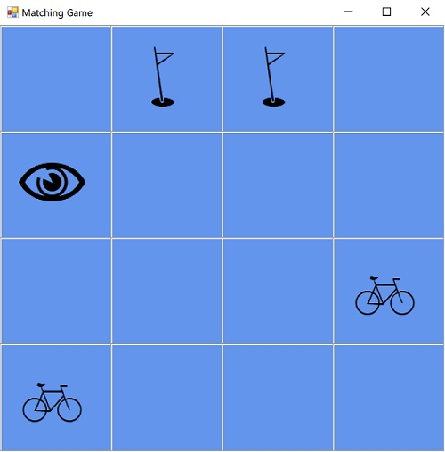

# Matching Game - sample for porting WinForms application from .NET Framework to .NET Core

## About the sample

This is a [Memory-style][memory-game] board game application. It contains a
WinForms UI (`MatchingGame.exe`) and a class library with the game logic
(`MatchingGame.Logic.dll`), both targeting .NET Framework 4.5. I used this
sample in the [blog post](https://) to demonstrate how to port the application
project to .NET Core 3.0 and the class library to .NET Standard 2.0.




## Step-by-step porting instructions

>I suggest doing the migration in a separate branch or, if you're not using
>version control, creating a copy of your project so you have a clean state to
>go back to if necessary.

### Preparing to port

1. **Install [.NET Core 3][core-installation]** and Update Visual Studio to 2019
   Preview version (Visual Studio 2017 will only support up to .NET Core 2.2).

1. **Start from a working solution**. Ensure the solution opens, builds, and
   runs without any issues.

1. **Update NuGet packages**. It is always a good practice to use the latest
   versions of NuGet packages before any migration. If your application is
   referencing any NuGet packages, update them to the latest version. Ensure
   your application builds successfully. In case of any NuGet errors, downgrade
   the version and find the latest one that doesn't break your code.

1. **Run [.NET Portability Analyzer][api-port]** to determine if there are any
   APIs your application depends on that are missing from .NET Core. In case
   there are, you need to refactor your code to avoid dependencies on not
   supported in .NET Core APIs. Sometimes it's possible to find an alternative
   API that provides the needed functionality.

1. **Replace `packages.config` with `PackageReference`**. If your project uses
   NuGet packages, you will need to add the same NuGet packages to the new .NET
   Core project. .NET Core projects support only `PackageReference` for adding
   NuGet packages. To move your NuGet references from `packages.config` to your
   project file, right-click on `packages.config` -> **Migrate packages.config
   to PackageReference...**.

   You can learn more about this migration in our [docs][pkg-config].

### Porting main project

1. **Migrate to the SDK-style .csproj file**. To move this application to .NET
   Core, first change the project file to SDK-style format because the old
   format does not support .NET Core.

   Make sure you have a copy of your current `.csproj` file. Replace the content
   of your `.csproj` file with the following:

   ```xml
   <Project Sdk="Microsoft.NET.Sdk">
     <PropertyGroup>
       <OutputType>WinExe</OutputType>
       <TargetFramework>net472</TargetFramework>
       <UseWPF>true</UseWPF>
       <GenerateAssemblyInfo>false</GenerateAssemblyInfo>
     </PropertyGroup>
   </Project>
   ```

   For WPF application use:

   ```xml
   <Project Sdk="Microsoft.NET.Sdk">
     <PropertyGroup>
       <OutputType>WinExe</OutputType>
       <TargetFramework>net472</TargetFramework>
       <UseWindowsForms>true</UseWindowsForms>
       <GenerateAssemblyInfo>false</GenerateAssemblyInfo>
     </PropertyGroup>
   </Project>
   ```

   > `<GenerateAssemblyInfo>` is set to `false` because in the new-style
   > projects `AssemblyInfo.cs` is generated automatically by default which will
   > result in duplication.

   The project should build successfully since it is just a new way of writing
   the same thing.

1. **Move from .NET Framework to .NET Standard or .NET Core**. After
   successfully converting the library to SDK-style format, retarget class
   library to [.NET Standard][standard] by replacing this

    ```xml
   <TargetFramework>net472</TargetFramework>
   ```

   with

   ```xml
   <TargetFramework>netstandard2.0</TargetFramework>
   ```

    Build the application. You will get an error "The name 'Registry' does not
    exist in the current context".

1. **Add Compatibility Pack**. Some APIs that are not included in .NET Standard
   are available in [Compatibility Pack][compat-pack]. To fix the error add the
   **Microsoft.Windows.Compatibility** NuGet package to the project. After
   installation, the error should disappear.

1. **Install API Analyzer**. [API Analyzer][api-analyzer], available as the
   NuGet package **Microsoft.DotNet.Analyzers.Compatibility**, will prompt you
   with warnings when you are using deprecated APIs or APIs that are not
   supported across all platforms (Windows, Linux, macOS). If you are using
   Compatibility Pack, I recommend adding the API Analyzer to keep track of all
   of API usages that won't work across all platforms.

   **The class library is migrated to .NET Standard!** Now migrate
   `MatchingGame.exe` project.

### Porting UI

1. **Add .NET Core UI project**. Add a new .NET Core 3.0 UI project to the
   solution. At this moment, the Visual Studio templates for desktop projects
   are under development, so I just used the `dotnet` CLI.

       ```cli
       dotnet new winforms -o <path-to-your-solution>\MatchingGame.Core\
       ```

    For WPF projects you'd use this:

       ```cli
       dotnet new wpf -o <path-to-your-solution>\MatchingGame.Core\
       ```

   After the new WinForms .NET Core project was created, add it to your
   solution.

1. **Link projects**. First, delete all files from the new project (right now it
   contains the generic Hello World code). Then, link all files from your
   existing .NET Framework UI project to the .NET Core 3.0 UI project by adding
   following to the `.csproj` file.

    ```xml
    <ItemGroup>
        <Compile Include="..\<Your .NET Framework Project Name>\**\*.cs" />
        <EmbeddedResource Include="..\<Your .NET Framework Project Name>\**\*.resx" />
    </ItemGroup>
    ```

   If you have a WPF application you also need to include `.xaml` files, for
   example:

   ```xml
   <ItemGroup>
     <ApplicationDefinition Include="..\WpfApp1\App.xaml" Link="App.xaml">
       <Generator>MSBuild:Compile</Generator>
     </ApplicationDefinition>
     <Compile Include="..\WpfApp1\App.xaml.cs" Link="App.xaml.cs" />
   </ItemGroup>

   <ItemGroup>
     <Page Include="..\WpfApp1\MainWindow.xaml" Link="MainWindow.xaml">
       <Generator>MSBuild:Compile</Generator>
     </Page>
     <Compile Include="..\WpfApp1\MainWindow.xaml.cs" Link="MainWindow.xaml.cs" />
   </ItemGroup>
   ```

1. **Align default namespace and assembly name**. Since you're linking to
   designer generated files (for example, `Resources.Designer.cs`) you generally
   want to make sure that the .NET Core version of your application uses the
   same namespace and the same assembly name. Copy the following settings from
   your .NET Framework project:

   ```xml
   <PropertyGroup>
       <RootNamespace><!-- (Your default namespace) --></RootNamespace>
       <AssemblyName><!-- (Your assembly name) --></AssemblyName>
   </PropertyGroup>
   ```

1. **Disable `AssemblyInfo.cs` generation**. As mentioned earlier, in the
   new-style projects, `AssemblyInfo.cs` is generated automatically by default.
   At the same time the `AssemblyInfo.cs` file from the old WinForms project
   will be copied to the new project too, because you linked all files `**\*.cs`
   in the previous step. That will result in duplication of `AssemblyInfo.cs`.
   To avoid it in `MatchingGame.Core` project file set `GenerateAssemblyInfo`
   to `false`.

   ```xml
   <GenerateAssemblyInfo>false</GenerateAssemblyInfo>
   ```

1. **Run new project**. Set your new .NET Core project as the StartUp project
   and run it. Make sure everything works.

1. **Copy or leave linked**. Now instead of linking the files, you can actually
   copy them from the old .NET Framework UI project to the new .NET Core 3.0 UI
   project. After that, you can get rid of the old project.

[memory-game]: https://en.wikipedia.org/wiki/Concentration_(game)
[core-installation]: https://dotnet.microsoft.com/download
[api-port]: https://blogs.msdn.microsoft.com/dotnet/2018/08/08/are-your-windows-forms-and-wpf-applications-ready-for-net-core-3-0/
[pkg-config]: https://docs.microsoft.com/nuget/reference/migrate-packages-config-to-package-reference
[compat-pack]: https://docs.microsoft.com/dotnet/core/porting/windows-compat-pack
[api-analyzer]:https://blogs.msdn.microsoft.com/dotnet/2017/10/31/introducing-api-analyzer/
[compat-pack]:https://blogs.msdn.microsoft.com/dotnet/2017/11/16/announcing-the-windows-compatibility-pack-for-net-core/
[standard]: https://docs.microsoft.com/dotnet/standard/net-standard
